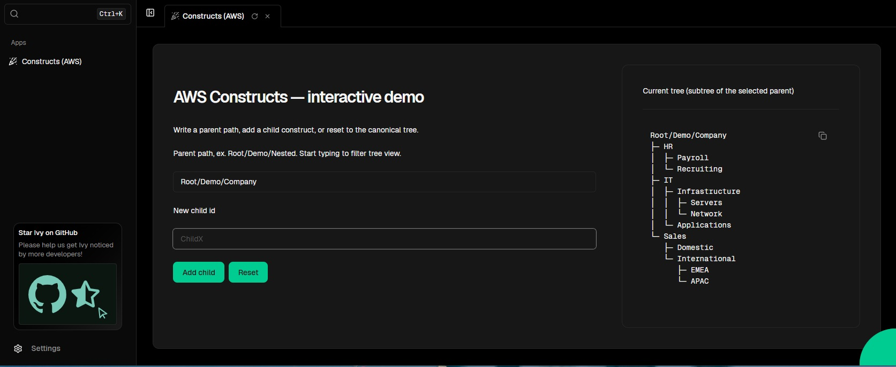

# Ivy Example: AWS Constructs

An interactive Ivy demo showcasing the basics of the [`Constructs`](https://github.com/aws/constructs) .NET package inside a pure C# Ivy app: build a small construct tree, inspect node paths, and add child nodes at runtime.

---

## Requirements

- **.NET 9 SDK**
- **Node.js 20 LTS** for **Constructs/jsii**
  The **Constructs** .NET package is built with **jsii** and launches a Node.js child process.

---

## Run

From this `constructs/` folder:

```bash
dotnet restore
dotnet watch
# Open the printed URL (e.g., http://localhost:5010)
```

If you see jsii/Node warnings or `$jsii.byref` errors, switch to **Node 20/22 LTS** and restart. That requirement comes from **Constructs/jsii**.

---

## What this demo shows

- **RootConstruct** as the root (no parent).
- **DemoConstruct** builds a canonical tree:

```
/Root
└─ Demo
   ├─ ChildA
   ├─ ChildB
   └─ Nested
      ├─ Leaf1
      └─ Leaf2
```

- **Interactive actions**

  - Write **Parent path** (e.g., `Root`, `/Root/Demo/Nested`).
  - **Add child** with any id (`new Construct(parent, id)`).
  - **Reset** to the canonical tree.
  - Compact **ASCII subtree** view with “Show more / Collapse”.

---

## UI overview

- **Left**: Controls (parent input, new child id, Add, Reset, status)
- **Right**: Current tree (ASCII, limited to N lines)



---

## Project structure

```
constructs/
├─ Apps/
│  └─ ConstructsApp.cs
├─ Domain/
│  ├─ Traversal.cs
│  └─ DemoConstruct.cs
├─ Extensions/
│  └─ ConstructExtensions.cs
├─ README.md
├─ screenshot.jpg
└─ Ivy.Examples.Constructs.csproj
```

Namespaces follow `Ivy.Examples.Constructs.*`. The app is registered with `[App(...)]` in `ConstructsApp.cs`.

---

## Why Node.js is needed (jsii)

The **Constructs** .NET package is generated via **jsii** and talks to a **Node.js** runtime under the hood. Ivy does not require Node, but when you use jsii-based packages (like Constructs), the jsii bridge spins up a Node child process. That’s why **Node 20 LTS** is mandatory here.

---

## Troubleshooting

- **Infinite spinner / `$jsii.byref` / init failed**
  Use **Node 20 LTS**, then:

  ```bash
  dotnet clean
  dotnet restore
  dotnet watch
  ```

- **Long tree output**
  Select a deeper parent path (subtree view) and use “Show more / Collapse”.
